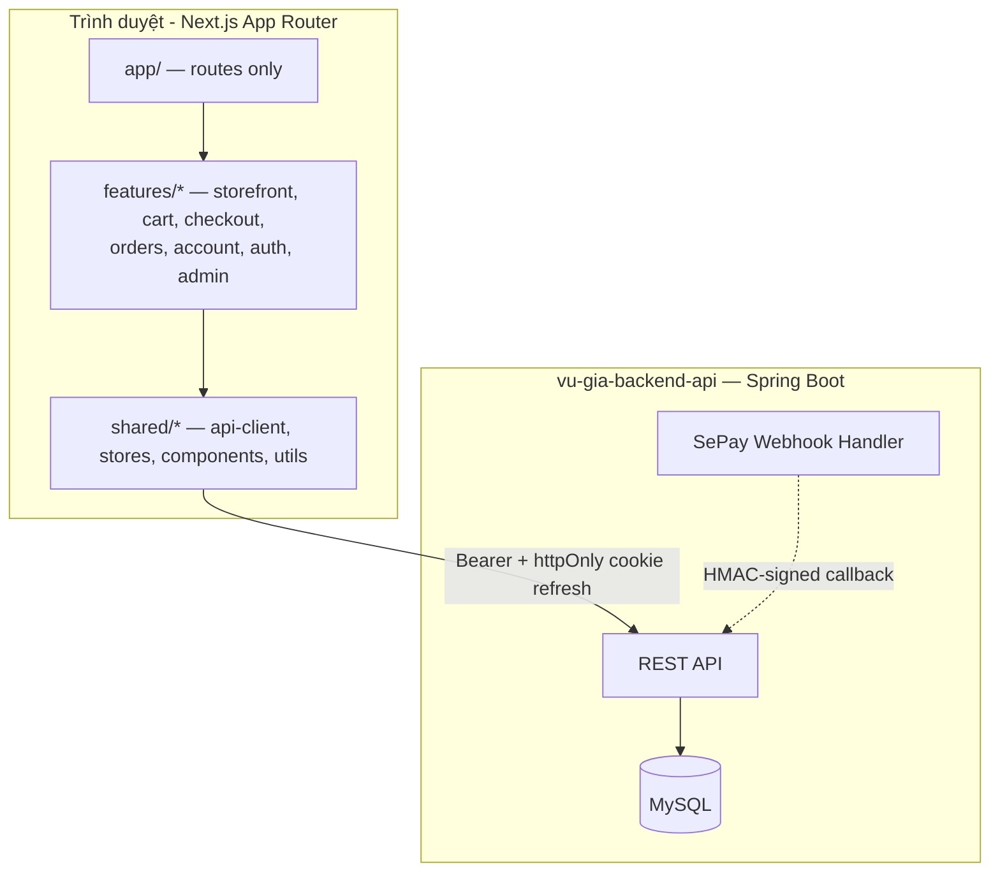
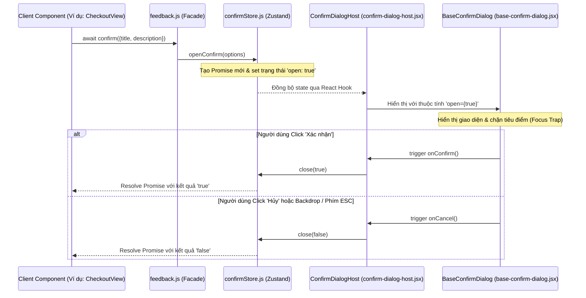

# Kiến trúc Hệ thống (System Architecture)

Tài liệu này mô tả chi tiết kiến trúc tổng quan, các luồng xử lý dữ liệu và thiết kế của các phân hệ chính trong ứng dụng **Gốm Sứ Vũ Gia - Client Portal**.

---

## 1. Mô hình kiến trúc tổng quan

Ứng dụng được xây dựng theo mô hình **Client-Server**: Next.js 15 (App Router) làm storefront + admin
CMS, giao tiếp với backend **Spring Boot** (`vu-gia-backend-api`, MySQL) qua RESTful JSON
(`{code,message,data,timestamp}` envelope). Có **hai phiên đăng nhập độc lập** cùng tồn tại trên client
(khách hàng + quản trị viên), mỗi phiên có store/API-client/refresh-token riêng, không chia sẻ trạng thái.

- **`shared/api/api-client.js`**: session-aware fetch wrapper dùng chung cho cả hai phiên — nhận một
  Zustand store (`adminAuthStore` hoặc `customerAuthStore`) làm tham số, tự đính `Authorization: Bearer`,
  tự refresh-on-401 (single-flight, không refresh trùng lặp khi nhiều request 401 cùng lúc). Refresh token
  thật sự nằm trong cookie `httpOnly`+`Secure`+`SameSite` (không nằm trong response body/localStorage) —
  gắn kèm CSRF token (`X-XSRF-TOKEN` đọc từ cookie `XSRF-TOKEN`) cho `POST /api/auth/refresh`.
  `shared/api/admin-api.js` (`adminApi`) và `features/auth/customer-api.js` (`customerApi`) là hai binding
  mỏng của `api-client.js` cho từng phiên. `shared/api/public-api.js` (`publicGet`/`publicPost`) phục vụ
  các endpoint công khai (catalog, coupon-validate, shipping-methods) — không đính token, không tự refresh.
- **Admin CMS** và **storefront khách hàng** dùng chung tầng UI (`shared/components/*`) nhưng độc lập về
  auth: `shared/stores/admin-auth-store.js` (chỉ ADMIN/SUPERADMIN) và `shared/stores/customer-auth-store.js`
  (CUSTOMER) — hai `refreshPromise` và hai khoá `persist` riêng, đăng xuất phiên này không ảnh hưởng phiên kia.

---

## 2. Các luồng xử lý cốt lõi (Core Data Flows)

### A. Luồng nghiệp vụ Giỏ hàng & Thanh toán (Shopping Flow) — API thật, không còn mock

`shared/stores/cart-store.js` vận hành **2 chế độ** (`mode: "guest" | "server"`):

1.  **Khách chưa đăng nhập (`guest`):** thêm/sửa/xoá giỏ hàng chỉ lưu local (`persist` → `localStorage`),
    dùng `productId` số thật (không còn id chuỗi giả).
2.  **Đăng nhập → merge:** `features/cart/cart-auth-bridge.jsx` (mount 1 lần trong `PublicLayout`) lắng
    nghe `customer-auth-store` chuyển trạng thái, gọi `mergeGuestCartToServer(userId)` — cộng dồn từng
    dòng giỏ khách vào giỏ server (`GET/POST/PUT /api/cart`), khoá bằng Web Locks API
    (`navigator.locks`) + cờ `localStorage` để **idempotent và an toàn đa tab** (mở 2 tab, đăng nhập cùng
    lúc, không merge trùng). Sau merge, store chuyển `mode: "server"`.
3.  **Đã đăng nhập (`server`):** mọi thao tác giỏ hàng gọi thẳng `features/cart/cart-service.js` rồi
    `hydrateFromServer()` để đồng bộ lại toàn bộ giỏ (số lượng/tổng tiền luôn lấy từ server, không tính
    lại ở client). Trang `/gio-hang` đọc qua `toCartLineVMList(items, mode)`
    (`features/cart/cart-view-model.js`) để UI không cần biết đang ở chế độ nào.
4.  **Đặt hàng (`/thanh-toan`):** `features/checkout/checkout-view.jsx` build payload thật
    `{idempotencyKey, items, couponCode?, paymentMethod, shippingMethodId?, receiverName, receiverPhone,
    receiverAddress, note?}` và gọi `POST /api/orders` (`features/orders/order-service.js`).
    `idempotencyKey` (`features/checkout/use-idempotency-key.js`) **giữ nguyên** qua các lần bấm lại/lỗi
    mạng, chỉ đổi mới sau khi nhận được đơn hàng 2xx — đảm bảo không tạo đơn trùng khi khách bấm 2 lần.
    Mã giảm giá được xem trước qua `POST /api/coupons/validate` (công khai) — chỉ là ước tính, tổng tiền
    thật luôn lấy từ response đặt hàng.
    *   **COD:** xác nhận ngay, giỏ hàng được **đồng bộ lại từ server** (`hydrateFromServer`, không
        `clearCart()` cứng) vì backend chỉ trừ đúng các dòng đã đặt, phần dư (nếu đặt một phần) vẫn còn.
    *   **ONL:** trả về `payment` (VietQR ảnh + thông tin chuyển khoản); trang kết quả
        (`features/checkout/order-result-view.jsx`, route `/thanh-toan/ket-qua/[id]`) poll
        `GET /api/orders/{id}` mỗi 4s tới khi `paymentStatus === "PAID"` hoặc hết 3 phút thì chuyển sang
        trang chi tiết đơn hàng để khách thanh toán lại sau. Thanh toán thật xác nhận qua **webhook SePay**
        (`POST /api/webhooks/sepay`, ký HMAC-SHA256, xem `vu-gia-backend-api/docs/ORDER_API.md` mục 7).
5.  **Sau khi đặt:** chuyển tới `/thanh-toan/ket-qua/[id]`; đơn hàng xuất hiện tại
    `/tai-khoan/don-hang` (`features/orders/orders-view.jsx`, lọc theo trạng thái + phân trang server).
    Khách có thể **huỷ đơn** (`POST /api/orders/{id}/cancel`) khi đơn còn `PENDING_PAYMENT`/`PROCESSING` —
    backend hoàn lại lượt dùng coupon nếu có, và khoá luôn việc thanh toán một đơn đã huỷ (đơn `CANCELLED`
    không còn expose `payment` QR nữa, tránh việc chuyển khoản trễ vô tình đánh dấu một đơn đã huỷ là
    `PAID`).

### B. Cơ chế hoạt động của Bộ tùy chỉnh đồ thờ (Altar Customizer)

Bộ tùy chỉnh đồ thờ (`/tuy-chinh-bo-do-tho`, `features/storefront/altar-customizer/`) là canvas kéo-thả
cho khách tự sắp xếp vật phẩm thờ lên ảnh bàn thờ, chọn model/kích thước/style, nạp preset dựng sẵn, tải
ảnh HTML offline, và (nếu đăng nhập) lưu/tải lại thiết kế từ thư viện cá nhân. Toàn bộ 6 phase build (bao
gồm Phase 6 — seed dữ liệu thật + verification) đã hoàn tất; tính năng **không còn dùng mock data** —
mọi domain đọc trực tiếp từ backend qua các API thật:

1.  **Nạp catalog (`hooks/use-altar-catalog.js`):** một lần khi mount, gọi song song
    `GET /altar-models` (kèm size), `GET /altar-item-groups`, `GET /altar-styles`, và
    `GET /altar-customizer/items` (feed sản phẩm `BO_DO_THO` đã gộp category/item-group/style — xem
    `vu-gia-backend-api/docs/system-architecture.md` mục 9). Lọc theo tab nhóm/style thực hiện **ở
    client** trên feed đã tải 1 lần (không refetch mỗi lần đổi filter) — hợp lý với quy mô catalog seed
    hiện tại (9 sản phẩm altar-set, xem Phase 6 report), cân nhắc refetch nếu catalog lớn hơn nhiều.
2.  **Canvas state (`hooks/use-altar-canvas-reducer.js` + `-core.js`):** reducer thuần quản lý danh sách
    item đã đặt (vị trí, scale, lật ngang, z-index), tách khỏi phần fetch dữ liệu.
3.  **Placement:** chỉ sản phẩm có `AltarPlacementEntity` thật (backend) mới kéo được lên canvas — hiện
    tại seed data chỉ có **bát hương** (3 ảnh `bat-huong-1/2/3.png`), các nhóm còn lại hiện trong palette
    với ảnh/giá thật nhưng nút "thêm vào bàn thờ" bị vô hiệu hoá có lý do rõ ràng, không phải lỗi (quyết
    định D1, xem backend docs mục 9).
4.  **Lưu thiết kế (`altar-design-service.js`):** khách đã đăng nhập lưu/đổi tên/xoá/tải lại thiết kế qua
    `/altar-designs/*` (giới hạn 20 thiết kế/tài khoản, enforce ở backend).
5.  **`components/data/altar-customizer-data.js`** giờ chỉ còn giữ lại `SIZE_GUIDE_ROWS` — bảng hướng
    dẫn chọn kích thước tĩnh, thuần nội dung biên tập, không có entity/seeder/admin CRUD tương ứng
    (quyết định D4) — mọi dữ liệu khác trước đây hardcode ở file này (model, style, sản phẩm, phụ kiện,
    giỏ hàng, sản phẩm tương tự) đã chuyển hết sang API thật.

---

## 3. Hệ thống thông báo và hộp thoại phản hồi toàn cục (Feedback System)

Ứng dụng trang bị hệ thống Feedback tập trung để thay thế các hàm native của trình duyệt. 

### Sơ đồ cơ chế hoạt động:

*   **Toaster & Host được đặt ở đâu?** Cả `AppToaster` (nhận diện Sonner) và `ConfirmDialogHost` (nhận diện modal xác nhận) được gắn tại layout dùng chung `PublicLayout` bao quanh toàn bộ các trang công cộng để sẵn sàng nhận tín hiệu thông báo từ bất kỳ view nào.
*   **Phân hệ quản trị:** Phân hệ Admin CMS sử dụng layout riêng (`AdminShell`) nhưng vẫn tích hợp `AppToaster` và thừa hưởng component `BaseConfirmDialog` với cấu hình theme `"admin"` (palette màu zinc tối giản).

---

## 4. Site Config Store & Bridge (Feature Flag: Cart-Mode Toggle)

Toàn site sử dụng một cơ chế thống nhất để lấy và đồng bộ hóa thiết đặt trang thương mại (site-wide settings), bao gồm cờ bật/tắt chế độ giỏ hàng.

### Thành phần cốt lõi:
- **`shared/stores/site-config-store.js`** (Zustand): lưu trạng thái `{ cartEnabled: boolean, isLoaded: boolean }`. Giá trị mặc định là `cartEnabled: true` cho đến khi dữ liệu được load từ server.
- **`shared/components/site-config-bridge.jsx`**: được mount trong `PublicLayout` (cạnh `CartAuthBridge`) → gọi `GET /api/site-settings` ngay khi component mount để fetch cấu hình và cập nhật store. Khi component unmount hoặc route khác nhau khiến `PublicLayout` re-mount, `SiteConfigBridge` cũng re-mount → gọi lại fetch. Hiện tại có **5 route groups riêng biệt** (mỗi cái mount `PublicLayout` độc lập), nên API được gọi tối đa 5 lần trên một phiên — **đây là một đánh đổi đã chấp nhận**: thay vì fetch 1 lần duy nhất ở session-level (cần thêm session store), chúng tôi chọn re-fetch ở mỗi mount để tránh mức độ phức tạp. Đơn giản và an toàn hơn là sự tối ưu tuyệt đối.
- **Consumer (Product, Customizer, Header)**: đọc `store.cartEnabled` trực tiếp qua hook để quyết định hiển thị/ẩn các CTA giỏ hàng; nếu `!store.isLoaded` thì hiển thị placeholder cho đến khi load xong.
