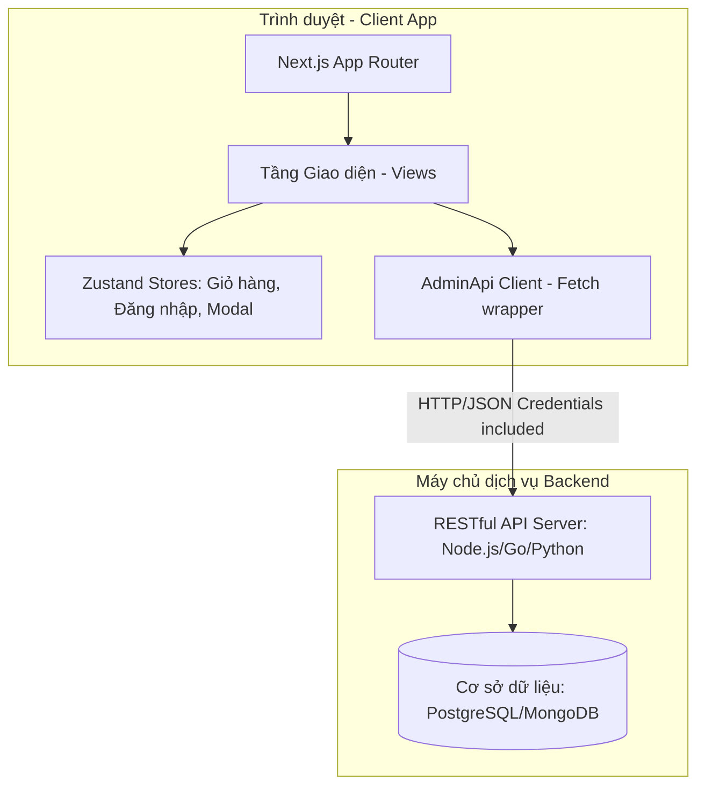
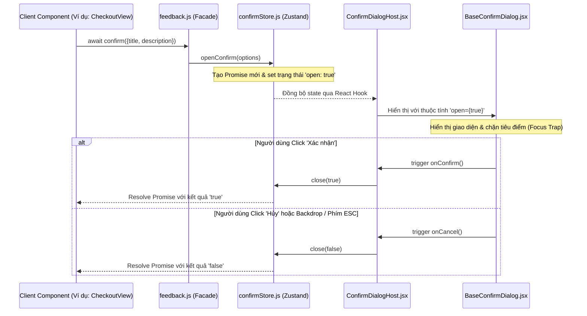

# Kiến trúc Hệ thống (System Architecture)

Tài liệu này mô tả chi tiết kiến trúc tổng quan, các luồng xử lý dữ liệu và thiết kế của các phân hệ chính trong ứng dụng **Gốm Sứ Vũ Gia - Client Portal**.

---

## 1. Mô hình kiến trúc tổng quan

Ứng dụng được xây dựng theo mô hình **Client-Server** sử dụng kiến trúc Next.js (App Router) giao tiếp phi trạng thái (Stateless) với Backend API thông qua các RESTful endpoints.

---

## 2. Các luồng xử lý cốt lõi (Core Data Flows)

### A. Luồng nghiệp vụ Giỏ hàng & Thanh toán (Shopping Flow)
1.  **Duyệt & Chọn mua:** Khách hàng click "Thêm vào giỏ" hoặc "Mua ngay" trên trang chi tiết sản phẩm.
2.  **Lưu trữ trạng thái:** `cartStore` nhận yêu cầu, cập nhật danh sách `items`, và ghi nhận xuống `localStorage` để duy trì dữ liệu khi F5 trang.
3.  **Tác vụ Giỏ hàng:** Trang `/gio-hang` (`CartView`) hiển thị danh sách từ store, cho phép tăng/giảm số lượng và tính toán tổng tiền tạm tính.
4.  **Đặt hàng & Thanh toán:** Trang `/thanh-toan` (`CheckoutView`) hiển thị form thông tin nhận hàng. Khi click "Hoàn tất":
    *   Hệ thống gọi API tạo đơn hàng (đính kèm danh sách sản phẩm và thông tin giao nhận).
    *   Hiện thông báo thành công qua `toast.success`.
    *   Hàm `clearCart()` được kích hoạt để dọn sạch giỏ hàng.
    *   Chuyển hướng người dùng về trang đơn hàng cá nhân `/tai-khoan/don-hang`.

### B. Cơ chế hoạt động của Bộ tùy chỉnh đồ thờ (Altar Customizer)
Bộ tùy chỉnh đồ thờ (`/tuy-chinh-bo-do-tho`) là một tính năng tương tác trực tiếp giúp người dùng tự cấu hình phòng thờ:
1.  **Khởi tạo dữ liệu:** Trạng thái bàn thờ được load từ cấu hình mặc định trong `altarCustomizerData.js` (kích thước bàn thờ, danh sách các vật phẩm thờ cần có: bát hương, mâm bồng, lọ hoa...).
2.  **Quản lý tương tác:** Custom hook `useAltarCustomizer.js` theo dõi:
    *   Loại sản phẩm được chọn (ví dụ: gốm men lam, gốm men rạn).
    *   Số lượng và kích thước của từng loại vật phẩm.
3.  **Đồng bộ hóa & Hiển thị:** Thay đổi của người dùng lập tức kích hoạt tính toán tổng tiền ước tính và vẽ mô phỏng sơ đồ sắp xếp tương ứng trên giao diện kéo thả trực quan.

---

## 3. Hệ thống thông báo và hộp thoại phản hồi toàn cục (Feedback System)

Ứng dụng trang bị hệ thống Feedback tập trung để thay thế các hàm native của trình duyệt. 

### Sơ đồ cơ chế hoạt động:

*   **Toaster & Host được đặt ở đâu?** Cả `AppToaster` (nhận diện Sonner) và `ConfirmDialogHost` (nhận diện modal xác nhận) được gắn tại layout dùng chung `PublicLayout` bao quanh toàn bộ các trang công cộng để sẵn sàng nhận tín hiệu thông báo từ bất kỳ view nào.
*   **Phân hệ quản trị:** Phân hệ Admin CMS sử dụng layout riêng (`AdminShell`) nhưng vẫn tích hợp `AppToaster` và thừa hưởng component `BaseConfirmDialog` với cấu hình theme `"admin"` (palette màu zinc tối giản).
