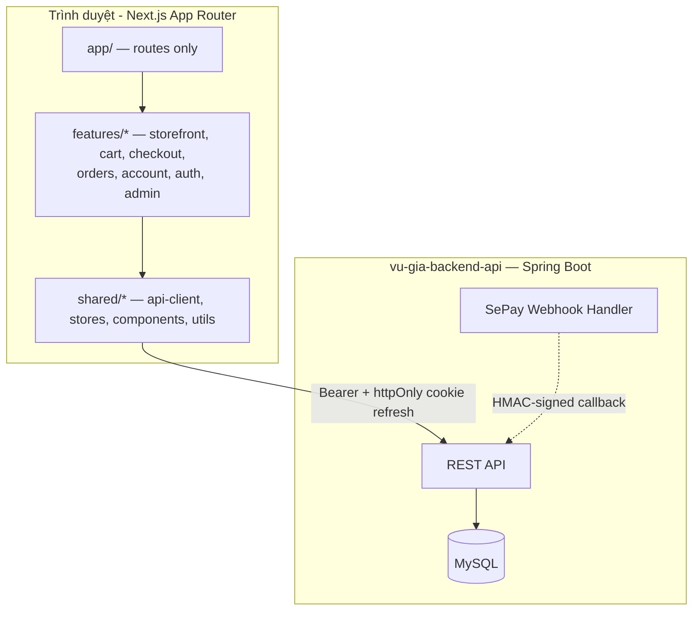
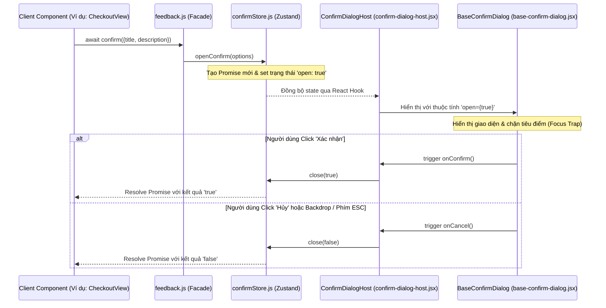

# Kiến trúc Hệ thống (System Architecture)

Tài liệu này mô tả chi tiết kiến trúc tổng quan, các luồng xử lý dữ liệu và thiết kế của các phân hệ chính trong ứng dụng **Gốm Sứ Vũ Gia - Client Portal**.

---

## 1. Mô hình kiến trúc tổng quan

Ứng dụng được xây dựng theo mô hình **Client-Server**: Next.js 15 (App Router) làm storefront + admin
CMS, giao tiếp với backend **Spring Boot** (`vu-gia-backend-api`, MySQL) qua RESTful JSON
(`{code,message,data,timestamp}` envelope). Có **hai phiên đăng nhập độc lập** cùng tồn tại trên client
(khách hàng + quản trị viên), mỗi phiên có store/API-client/refresh-token riêng, không chia sẻ trạng thái.

- **`shared/api/api-client.js`**: session-aware fetch wrapper dùng chung cho cả hai phiên — nhận một
  Zustand store (`adminAuthStore` hoặc `customerAuthStore`) làm tham số, tự đính `Authorization: Bearer`,
  tự refresh-on-401 (single-flight, không refresh trùng lặp khi nhiều request 401 cùng lúc). Refresh token
  thật sự nằm trong cookie `httpOnly`+`Secure`+`SameSite` (không nằm trong response body/localStorage) —
  gắn kèm CSRF token (`X-XSRF-TOKEN` đọc từ cookie `XSRF-TOKEN`) cho `POST /api/auth/refresh`.
  `shared/api/admin-api.js` (`adminApi`) và `features/auth/customer-api.js` (`customerApi`) là hai binding
  mỏng của `api-client.js` cho từng phiên. `shared/api/public-api.js` (`publicGet`/`publicPost`) phục vụ
  các endpoint công khai (catalog, coupon-validate, shipping-methods) — không đính token, không tự refresh.
- **Admin CMS** và **storefront khách hàng** dùng chung tầng UI (`shared/components/*`) nhưng độc lập về
  auth: `shared/stores/admin-auth-store.js` (chỉ ADMIN/SUPERADMIN) và `shared/stores/customer-auth-store.js`
  (CUSTOMER) — hai `refreshPromise` và hai khoá `persist` riêng, đăng xuất phiên này không ảnh hưởng phiên kia.

---

## 2. Các luồng xử lý cốt lõi (Core Data Flows)

### A. Luồng nghiệp vụ Giỏ hàng & Thanh toán (Shopping Flow) — API thật, không còn mock

`shared/stores/cart-store.js` vận hành **2 chế độ** (`mode: "guest" | "server"`):

1.  **Khách chưa đăng nhập (`guest`):** thêm/sửa/xoá giỏ hàng chỉ lưu local (`persist` → `localStorage`),
    dùng `productId` số thật (không còn id chuỗi giả).
2.  **Đăng nhập → merge:** `features/cart/cart-auth-bridge.jsx` (mount 1 lần trong `PublicLayout`) lắng
    nghe `customer-auth-store` chuyển trạng thái, gọi `mergeGuestCartToServer(userId)` — cộng dồn từng
    dòng giỏ khách vào giỏ server (`GET/POST/PUT /api/cart`), khoá bằng Web Locks API
    (`navigator.locks`) + cờ `localStorage` để **idempotent và an toàn đa tab** (mở 2 tab, đăng nhập cùng
    lúc, không merge trùng). Sau merge, store chuyển `mode: "server"`.
3.  **Đã đăng nhập (`server`):** mọi thao tác giỏ hàng gọi thẳng `features/cart/cart-service.js` rồi
    `hydrateFromServer()` để đồng bộ lại toàn bộ giỏ (số lượng/tổng tiền luôn lấy từ server, không tính
    lại ở client). Trang `/gio-hang` đọc qua `toCartLineVMList(items, mode)`
    (`features/cart/cart-view-model.js`) để UI không cần biết đang ở chế độ nào.
4.  **Đặt hàng (`/thanh-toan`):** `features/checkout/checkout-view.jsx` build payload thật
    `{idempotencyKey, items, couponCode?, paymentMethod, shippingMethodId?, receiverName, receiverPhone,
    receiverAddress, note?}` và gọi `POST /api/orders` (`features/orders/order-service.js`).
    `idempotencyKey` (`features/checkout/use-idempotency-key.js`) **giữ nguyên** qua các lần bấm lại/lỗi
    mạng, chỉ đổi mới sau khi nhận được đơn hàng 2xx — đảm bảo không tạo đơn trùng khi khách bấm 2 lần.
    Mã giảm giá được xem trước qua `POST /api/coupons/validate` (công khai) — chỉ là ước tính, tổng tiền
    thật luôn lấy từ response đặt hàng.
    *   **COD:** xác nhận ngay, giỏ hàng được **đồng bộ lại từ server** (`hydrateFromServer`, không
        `clearCart()` cứng) vì backend chỉ trừ đúng các dòng đã đặt, phần dư (nếu đặt một phần) vẫn còn.
    *   **ONL:** trả về `payment` (VietQR ảnh + thông tin chuyển khoản); trang kết quả
        (`features/checkout/order-result-view.jsx`, route `/thanh-toan/ket-qua/[id]`) poll
        `GET /api/orders/{id}` mỗi 4s tới khi `paymentStatus === "PAID"` hoặc hết 3 phút thì chuyển sang
        trang chi tiết đơn hàng để khách thanh toán lại sau. Thanh toán thật xác nhận qua **webhook SePay**
        (`POST /api/webhooks/sepay`, ký HMAC-SHA256, xem `vu-gia-backend-api/docs/ORDER_API.md` mục 7).
5.  **Sau khi đặt:** chuyển tới `/thanh-toan/ket-qua/[id]`; đơn hàng xuất hiện tại
    `/tai-khoan/don-hang` (`features/orders/orders-view.jsx`, lọc theo trạng thái + phân trang server).
    Khách có thể **huỷ đơn** (`POST /api/orders/{id}/cancel`) khi đơn còn `PENDING_PAYMENT`/`PROCESSING` —
    backend hoàn lại lượt dùng coupon nếu có, và khoá luôn việc thanh toán một đơn đã huỷ (đơn `CANCELLED`
    không còn expose `payment` QR nữa, tránh việc chuyển khoản trễ vô tình đánh dấu một đơn đã huỷ là
    `PAID`).

### B. Cơ chế hoạt động của Bộ tùy chỉnh đồ thờ (Altar Customizer)
Bộ tùy chỉnh đồ thờ (`/tuy-chinh-bo-do-tho`) là một tính năng tương tác trực tiếp giúp người dùng tự cấu hình phòng thờ:
1.  **Khởi tạo dữ liệu:** Trạng thái bàn thờ được load từ cấu hình mặc định trong `data/altar-customizer-data.js` (kích thước bàn thờ, danh sách các vật phẩm thờ cần có: bát hương, mâm bồng, lọ hoa...).
2.  **Quản lý tương tác:** Custom hook `hooks/use-altar-customizer.js` theo dõi:
    *   Loại sản phẩm được chọn (ví dụ: gốm men lam, gốm men rạn).
    *   Số lượng và kích thước của từng loại vật phẩm.
3.  **Đồng bộ hóa & Hiển thị:** Thay đổi của người dùng lập tức kích hoạt tính toán tổng tiền ước tính và vẽ mô phỏng sơ đồ sắp xếp tương ứng trên giao diện kéo thả trực quan.

---

## 3. Hệ thống thông báo và hộp thoại phản hồi toàn cục (Feedback System)

Ứng dụng trang bị hệ thống Feedback tập trung để thay thế các hàm native của trình duyệt. 

### Sơ đồ cơ chế hoạt động:

*   **Toaster & Host được đặt ở đâu?** Cả `AppToaster` (nhận diện Sonner) và `ConfirmDialogHost` (nhận diện modal xác nhận) được gắn tại layout dùng chung `PublicLayout` bao quanh toàn bộ các trang công cộng để sẵn sàng nhận tín hiệu thông báo từ bất kỳ view nào.
*   **Phân hệ quản trị:** Phân hệ Admin CMS sử dụng layout riêng (`AdminShell`) nhưng vẫn tích hợp `AppToaster` và thừa hưởng component `BaseConfirmDialog` với cấu hình theme `"admin"` (palette màu zinc tối giản).
